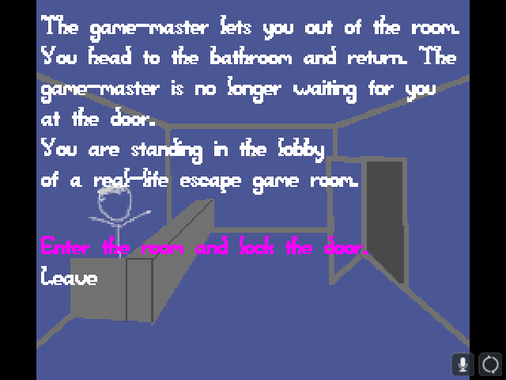

# Virtual Real-Life Escape Game Room

Author: Benjamin Huang

Design: The game brings the real-life escape game room back to the computer, in all its real-life glory. Not really glory.
A story parser parses the escape-room.story file at runtime. You can modify escape-room.story to change the game.
Check the readme in the resources directory and see desert-planet.story for another example (with basically the story for the original planet game).

Screen Shot:

How To Play:

Use the arrow keys to select an option. Press Enter to submit.

Art Sources:

All art was self drawn. Inspiration for the sitck figure from xkcd.com.

This game was built with [NEST](NEST.md).
